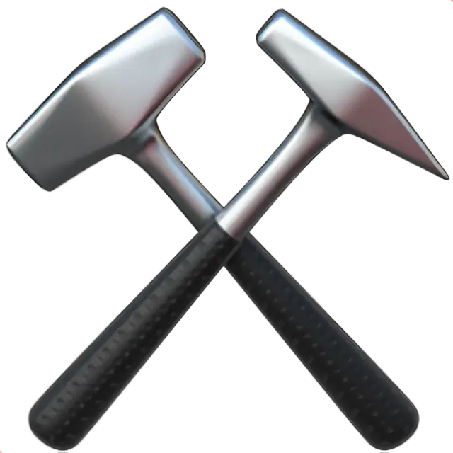

  
  
  # HammerTool
  
  **A next-generation Interactive Map Editor & Skin Studio.**
  
  
  
  
  

---

## ✨ Overview

**HammerTool** delivers a premium, state-of-the-art visual experience for building, sharing, and styling custom map layouts. Featuring a gorgeous **Neon Midnight** glassmorphism UI, dynamic particle backgrounds, and a complete marketplace for custom tile textures, it serves as a next-gen toolkit for map creators.

## 🚀 Key Features

- 🛠️ **Interactive Map Editor**: Advanced layer-based object-oriented editor with 180-degree rotational smart symmetry, automatic fence tiling, custom environments, and fluid spatial controls.
- 🎨 **Custom Tiles Studio**: Upload, design, and publish unique texture packs for standard tiles. Features an integrated **Pixel-Perfect Cropping Tool** (CropperJS).
- 🛒 **Tile Pack Marketplace**: Browse community-created skins, upvote your favorites, and equip customized packs to seamlessly skin your canvas.
- 🖼️ **Interactive Map Gallery**: Explore, vote on, and sort community-made maps. Single-click loads any public masterpiece directly into your viewport.
- 🔒 **Private Vault & Map History**: Securely save drafts, edit details, and manage your entire archive of created maps.
- 💾 **Advanced Exporter**: Instantly render your layered coordinate matrices into pixel-perfect, high-definition PNG preview images.
- 🔐 **Discord Integration**: Complete OAuth2 integration using Supabase Auth to authorize map authorship and texture uploads.

## 🛠️ Technologies Used

  

- **Language**: Strictly typed, robust **TypeScript** compiled into optimized ECMAScript modules.
- **Frontend**: HTML5, Modern CSS3 (Custom Variables, Keyframe Nebula Animations).
- **Backend & Core**: 
  - **Supabase**: Authentication, PostgreSQL Database, Storage Buckets, and Realtime Client.
- **Visuals**: HTML5 Canvas API for fluid particle vortex rendering; CropperJS for client-side image processing.

---

## 🙏 Credits & Attribution

> [!NOTE]
> **Asset Source:**
> This project is developed and maintained by a single creator. Some of the visual assets used here—specifically the **PNG tile textures**—were sourced from **[atlas-horizon](https://github.com/She-Fairy/atlas-horizon)**, a project by **[She-Fairy](https://github.com/She-Fairy)**.
>
> Big thanks to She-Fairy for creating these resources and sharing them with the community. All original rights belong to the respective author.

## ⚖️ Legal Disclaimer

> [!IMPORTANT]  
> This site is NOT affiliated with, endorsed, sponsored, or specifically approved by Supercell. Brawl Stars and all related art, assets, and trademarks belong exclusively to **Supercell**.

---

  Developed with ❤️ for the Brawl Craft Community.

